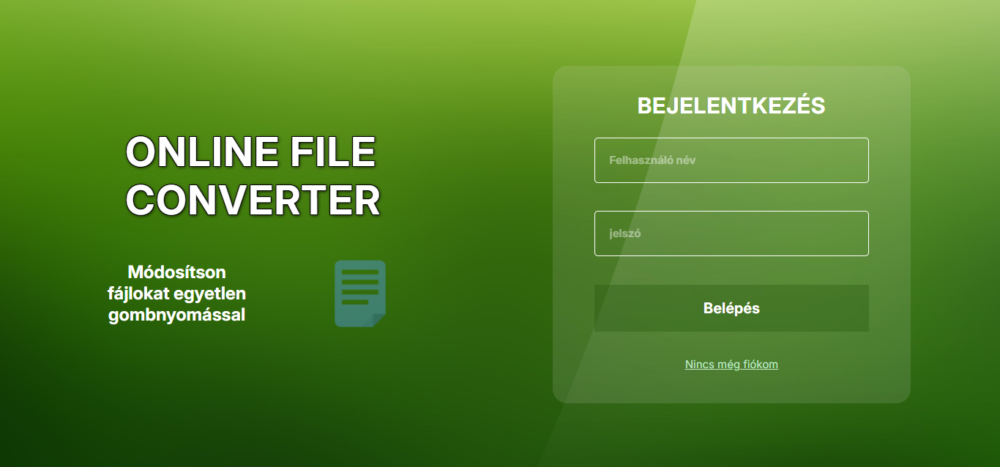
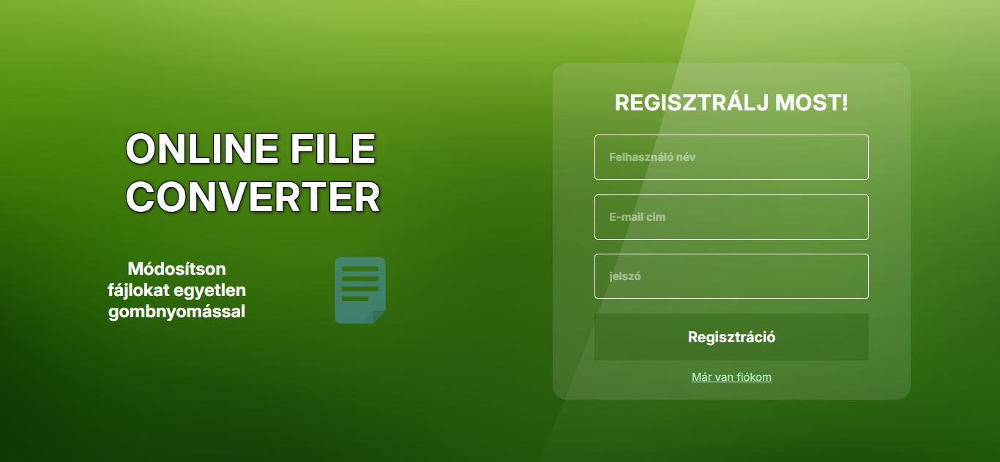
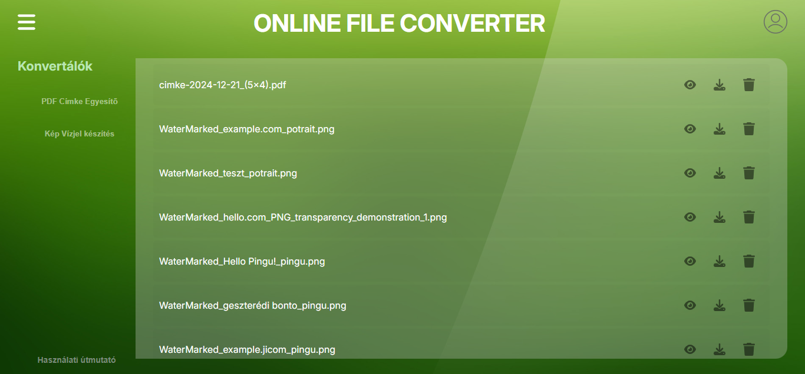
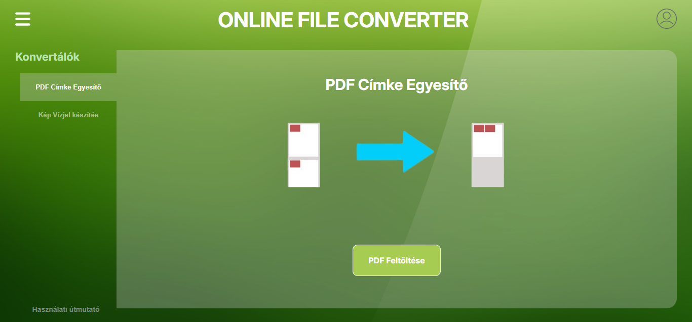
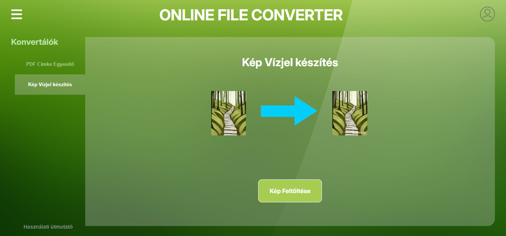
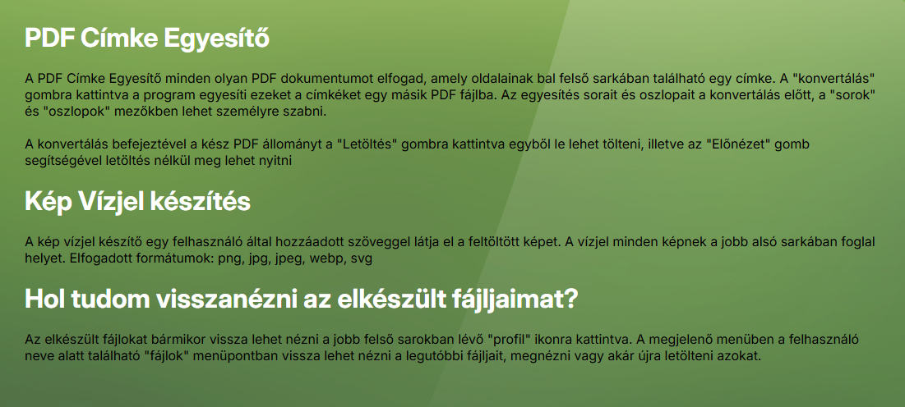

# Online File Converter Dokumentációja

## Bevezetés

Az Online File Converter célja, hogy egy saját felületen keresztül lehetővé tegye a vállalkozásunk számára a weboldalon való megjelenéshez szükséges címke átméretezését, a feltöltött autóalkatrész méretéhez való jobb alkalmazkodását. A Kép Vízjel készítés pedig szintén azért készült, hogy a későbbiekben egy a saját weboldalon, a saját autóalkatrészeink képeit saját vízjellel, saját szöveges megjelöléssel láthassuk el.

### Motiváció

A Converter alkalmazás azzal a céllal készült, hogy költséghatékonyabbá, egyszerűbbé tegyük a weboldal üzemeltetője által a vállalkozásunk számára generált egyen címkét. A címkét a weboldal üzemeltetője generálja, mely tartalmazza az autóalkatrész árusító weboldalon történő megjelenéshez szükséges adatokat. A weboldal tulajdonos által küldött első 300 címke használata során felmerült a vállalkozásunkban a változtatás igénye, mert mind árban, mind méretben más elvárásunk volt a címkével kapcsolatban. A címkéket a weboldal tulajdonosa nyomtatva postázza, ha nincs lehetőség nyomtatásra, ez nagy mennyiségű szükséglet esetén nagy költséggel jár. A küldött standart méret sok alkatrészre nagy, lelóg róla, hosszabb tárolás esetén leesik, és eltűnik, így nem lehet beazonosítani a már felrögzített terméket. A tulajdonos által küldött tekercses kivitel beszerzése drága, sok felületre nem lehet ragasztani, több terméket a tisztántartás és a karcmentesség miatt be kell fóliázni nincs értelme a költséges ragasztásnak. A címke generátor segítségével a kódolt címkét A4-es méretre, sima nyomtató papírra nyomtatva vállalkozásunk jelentősen csökkenti a termékek regisztrálásának  költségeit. A Converter használata nagyon megkönnyítette a munkánkat, mert nincs szükség hetekkel előre megrendelni a felhasználni kívánt címke mennyiséget, saját szükséglet szerint, egy tintasugaras nyomtatóval, A4-es irodai papírra kinyomtatva, azonnal használni tudjuk a címkéket. A címke készítése során nem volt cél a tárolás és archiválás, mert minden címkét csak egyszer lehet felhasználni, ezért a program nem tárolja el a feltöltött pdf fájlt.

A nem túl távoli jövőben szeretnénk egy saját webáruházat is indítani, ahol az általunk árusított autóalkatrészeket szeretnénk feltölteni.

Ezért készült el a Kép Vízjel készítő alkalmazás. 
Amikor a mostani, sokak által ismert webáruházba rögzítem a termékeket, az autóalkatrész pontos meghatározásához a cikkszámot beírom az internet keresőjébe és így beazonosítom a pontos évjáratot, motortípust, és persze a mások által meghatározott árat is. Így vettem észre, hogy a mi termékeink mosás és takarítás nélkül is jobban néznek ki, mint a webáruházban lévő más vállalkozások termékei. Ezért készült a Kép Vízjel készítő, hogy a saját képeinket megkülönböztethessük a mások által feltöltött képektől, megnehezítsük az illetéktelen felhasználásukat. Ebben a programban, a későbbiekben, a webáruház elkészítése után, szükség lesz olyan opcióra, mely a működés során felkínálja a mentés tárolás és a bővítés lehetőségét is, most azonban ez még nem feltétele a program működésének.  A két program készítése során további lehetőségként felmerült, hogy érdemes lenne egy olyan program készítésébe belevágni ami átvenné számlázási és postázási feladatokat. A távolabbi cél pedig egy saját  jól működő webáruház létrehozása. 

Mindkét program egyszerű szerkezetű, egyszerű felhasználást tesz lehetővé. Mégis számunkra ezeknek a programoknak az elkészítése során kiderült, úgyis mint készítő és úgyis, mint felhasználó, hogy sokszor egy könnyen kezelhető jól megválasztott vagy kiválasztott program, milyen óriási segítséget jelenthet egy kisvállalkozás működése során.


.

---

## Fejlesztői dokumentáció

### 2.1 Fejlesztőkörnyezet

Az Online File Converter és a Kép Vízjel készítő  fejlesztése során a következő eszközöket és technológiákat használtuk:

- **Hardver:** Számítógép, laptop
- **Tervezés:** Paint
- **Programozási nyelvek:** Python, MySQL, Django
- **Szoftverek:** Visual Studio Code, Django, Paint

### 2.2 Adatszerkezet

Az alkalmazás adatszerkezete az alábbiak szerint alakult:

- **Adatbázis:** SQLite
- **Táblák:** File
- **Főbb változók:** owner, filename


### 2.3 Algoritmusok

Az alkalmazás egyedi és érdekesebb algoritmusai közé tartoznak:

- Felhasználók bejelentkezésének és regisztrációjának ellenőrzése
- Használati útmutató megtekintése
- A generált fájlok megtekintése, letöltése
•	Nyers képek feltöltése 
•	A feltöltött kép egyedi vízjeles letöltése


```python
class Login_page(View):
    def get(self, request):
         return render(request, 'generator/login.html')
    
    def post(self, request):
        form = LoginForm(request.POST)

        if form.is_valid():
            user = authenticate(
                username = form.cleaned_data['username'],
                password = form.cleaned_data['password']
            )

            if user is not None:
                login(request, user)
                return redirect('index')


        return render(request, 'generator/login.html')


class Logout_page(View)
    def get(self,request):
        logout(request)
        return redirect('login_page')
```



### 2.4 Tesztelés

Az alkalmazás tesztelése során a következő körülményeket vizsgáltuk:

- Különböző böngészők (Chrome, Firefox, Safari)
- Különböző eszközök (számítógép, tablet)
- Adatbázis hibakezelés
- Az egyesített fájlok helyessége

```python
# link a fájl letöltéséhez
class Download(View):
    def get(self,request,userName, fileName):
        if str(request.user.username) == userName:
            file = os.path.join(settings.BASE_DIR, f"output/{userName}/{fileName}")
            fileOpened = open(file, 'rb')
        
            return FileResponse(fileOpened)    
            
        return redirect('index')
    
# link a fájl törléséhez
class Delete(View):
    def get(self,request,userName,id,fileName):
        if str(request.user.username) == userName:
            f_path = os.path.join(settings.BASE_DIR, "output", userName, fileName)
            if os.path.exists(f_path):
                os.remove(f_path)

            f = File(id=id,owner=request.user, filename=fileName)
            f.delete()

            dir = os.path.join(settings.BASE_DIR, "output", userName)
            if not os.listdir(dir): os.rmdir(dir)

        return redirect('index')
```


### 2.5 Fejlesztési lehetőségek

A továbbfejlesztési lehetőségek közé tartoznak:

- Felhasználói profilok bővítése
- Bővítés Androidra
- Újabb fájlkezelési funkciók hozzáadása

---

## Felhasználói dokumentáció

### 3.1 Program célja és funkciói

A programunk a különálló oldalakon lévő címkék összeolvasztását teszi lehetővé.
A Kép Vízjel készítő esetében egyedi, sajátságos képek létrehozása.
Mindkét program egyszerű, de a vállalkozás tevékenységét nagyban segíti, hatékonyabb munkavégzést tesz lehetővé.





### 3.2 Szükséges eszközök és szoftverek

A weblaplapunk használatához csak hardverre és a nyers fájlokra van szükség.

### 3.3 Telepítés és indítás

Weblapunk lokális használatra készült.

### 3.4 Program használata

A program használata egyszerű. A weblap indításakor a felhasználó feltölti a nyers fájlokat, majd az elkészült dokumentumot letölti.
A Kép Vízjel készítő használatához a saját mentett képünket feltöltjük, beírjuk azt a szöveget, amit meg szeretnénk jeleníteni a képen, majd az elkészült képet letöltjük.


### 3.5 Hibajelzések

Mivel a felhasználó ismeri a fájlok tulajdonságait, ezért nincs szükség hibajelzésre.

### 3.6 Admin felhasználó lehetőségei

Az admin egyben a végfelhasználó is.

```python
def post(self,request):
    if request.user.is_authenticated:

        formCimke = UploadCimkeFileForm(request.POST, request.FILES)
        formVizjel = UploadVizjelFileForm(request.POST, request.FILES)
        files = File.objects.filter(owner=request.user)

        # PDF Cimke Egyesítő
        # PDF végződés és konverter ellenőrzése
        if (formCimke.is_valid()) and str(request.FILES.get('file'))[-4:] == ".pdf" and str(request.POST.get("converter")) == "cimke":

            os.makedirs(os.path.join(settings.BASE_DIR, "generator\\Static\\tempFiles", str(request.user.username)), exist_ok=True)
            
            file_path = os.path.join(settings.BASE_DIR, "generator\\Static\\tempFiles", str(request.FILES.get('file')))
            file = request.FILES.get('file')
            cols = int(request.POST.get('cols'))
            rows = int(request.POST.get('rows'))
            username = str(request.user.username)
            os.makedirs(os.path.join(settings.BASE_DIR, "output", username), exist_ok=True)
                
            # Fájl mentése
            with open(file_path, "wb+") as destination:
                for chunk in file.chunks():
                    destination.write(chunk)
            
            # Fájl átalakitása         
            file_name, alreadyExists = cimke.convert(file_path,cols,rows,username)
            
            if(not alreadyExists):
                f = File(owner=request.user, filename=file_name)
                f.save()

            os.remove(file_path)

            return render(request,"generator/index.html", {"file" : file_name, 'files' : files, 'spaceId' : 1})

        # Kép Vízjelezés
        # képformátum ('.png','.jpg','.jpeg','.webp','.svg') és konverter ellenőrzése
        fourChar = str(request.FILES.get('file'))[-4:]
        fiveChar = str(request.FILES.get('file'))[-5:]
        print(fourChar)
        print(fiveChar)
        if (formVizjel.is_valid() and str(request.POST.get("converter")) == "vizjel" and (
            (fourChar == '.png' or '.jpg' or '.svg') or
            (fiveChar == '.jpeg' or '.webp')
        )):
            os.makedirs(os.path.join(settings.BASE_DIR, "generator\\Static\\tempFiles", str(request.user.username)), exist_ok=True)

            file_path = os.path.join(settings.BASE_DIR, "generator\\Static\\tempFiles", str(request.FILES.get('file')))
            file = request.FILES.get('file')
            watermark = request.POST.get('watermark')
            username = str(request.user.username)
            os.makedirs(os.path.join(settings.BASE_DIR, "output", username), exist_ok=True)
            
            # Fájl mentése
            with open(file_path, "wb+") as destination:
                for chunk in file.chunks():
                    destination.write(chunk)

            # Fájl átalakitása         
            file_name, alreadyExists = vizjel.convert(file_path,watermark,username,str(file))
            
            if(not alreadyExists):
                f = File(owner=request.user, filename=file_name)
                f.save()

            os.remove(file_path)

            return render(request,"generator/index.html", {"file" : file_name, 'files' : files, 'spaceId' : 2})

        return render(request, "generator/index.html", {'files': files, 'spaceId' : 1})
    
    return redirect('login_page')
```
